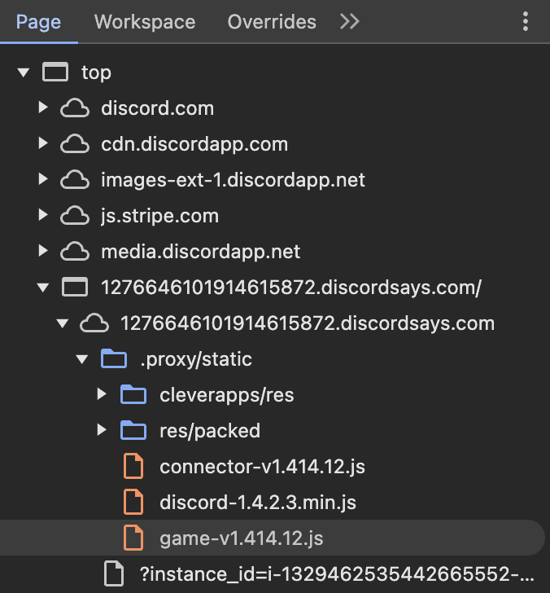
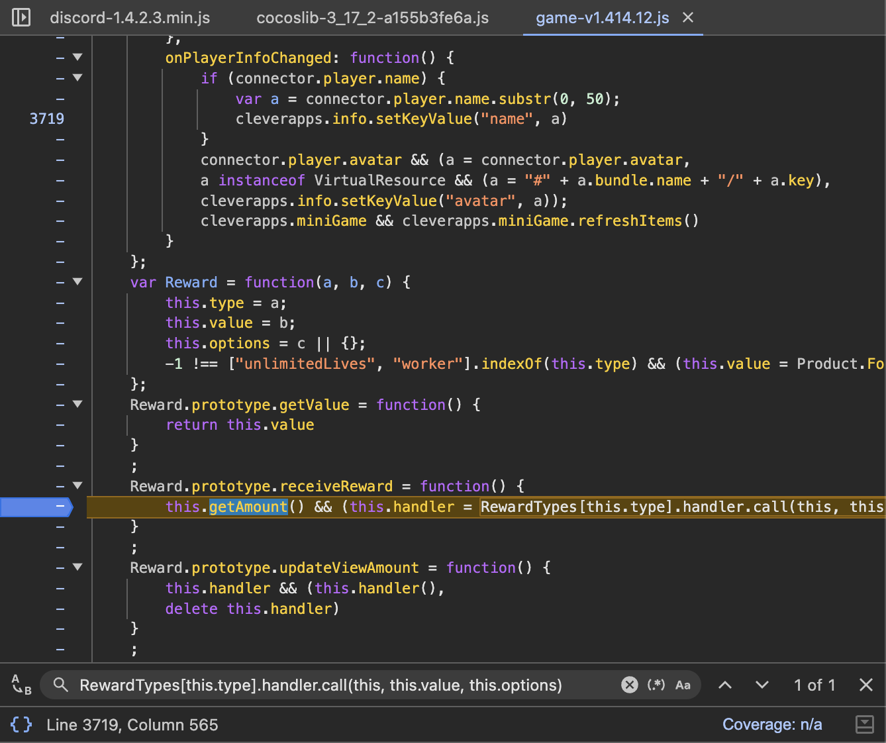
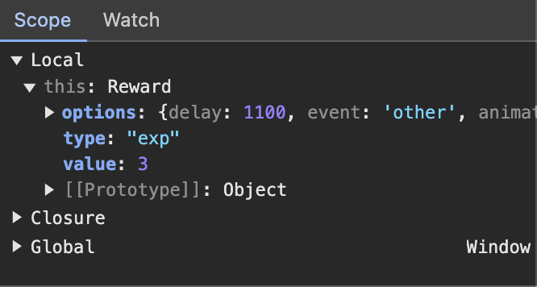
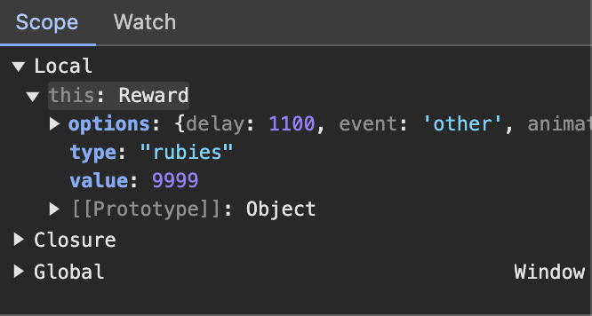
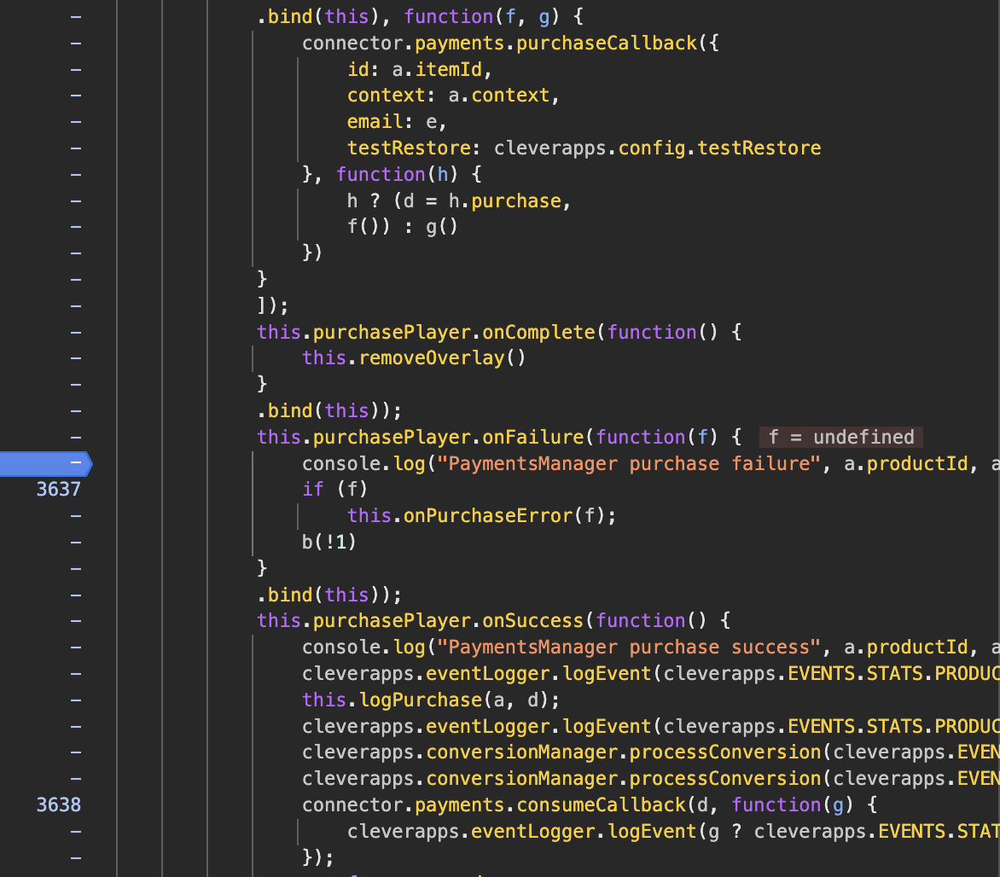
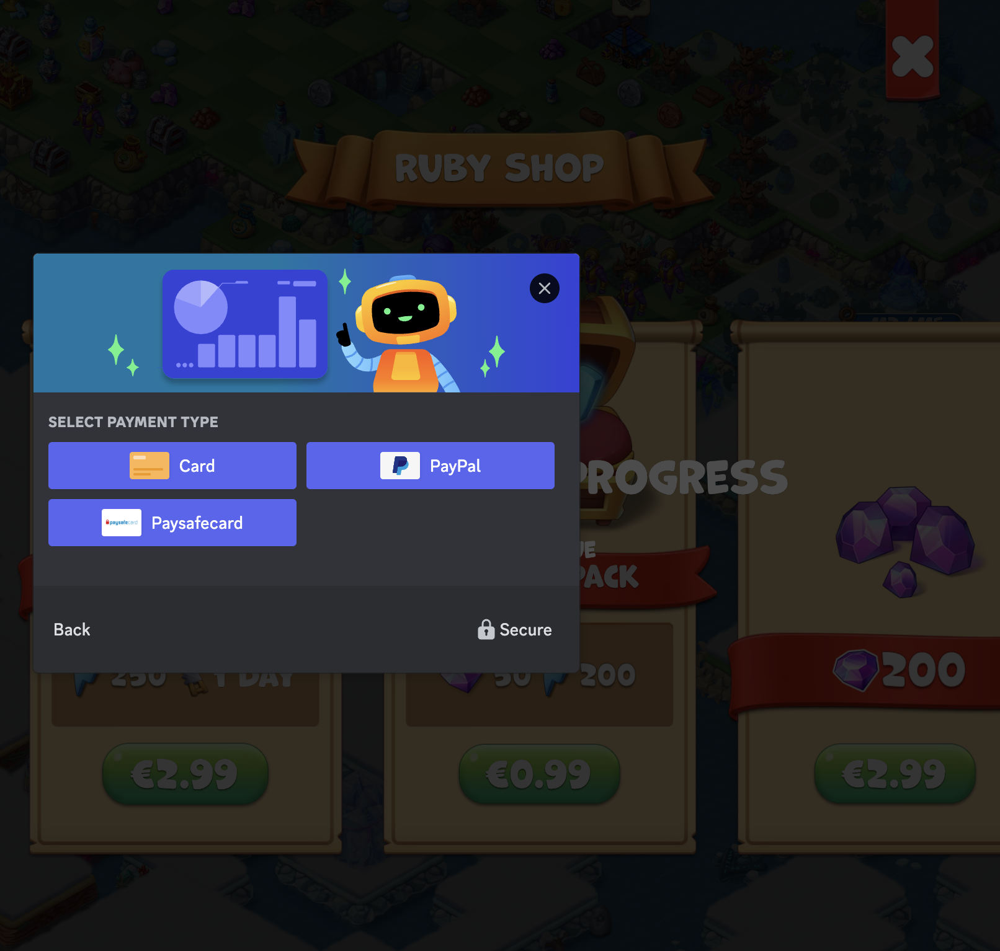

<p align="center">
  
</p>

<h1 align="center">[Discord] - Mergest Kingdom Injector</h1>

<p align="left">
  Mergest Kingdom Injector lets you set up various methods for modifying content in the Mergest Kingdom discord game. Perform these steps preferably from a Google Chrome browser. There is currently no guarantee that these methods will work on other browsers.
  These methods go against the rules of the game's developers, and waves of bans have already occurred. I am in no way responsible for your actions. Please use this tool with full knowledge of the risks involved.
</p>


## Disclaimer

|Mergest Kingdom Injector was made for Educational purposes   |
|-------------------------------------------------|
This project was created only for good purposes and personal use.
By using this Tool, you agree that you hold responsibility and accountability of any consequences caused by your actions.

## Features

- [x] - [giveInventoryItem](https://github.com/AstraaDev/MergestKingdom-Injector) - Obtain any object in unlimited quantities.
- [x] - [byPassGamePurchases](https://github.com/AstraaDev/MergestKingdom-Injector) - Get paid packs for free. *(by @mgiannopoulos24)*

## Common part of each method
Each of the methods described here works in the same way. The game needs to be “paused” at the right moment to access certain elements that are normally blocked. The differences between these methods are the information to be retrieved, the precise moment to break the script, the action to be taken to break the script, etc...
Even if these parts change depending on the method, the beginning remains the same.

#### Setup
- Launch of Mergest Kingdom on discord *(and never close it again until the end)*
- Open the browser console (by pressing `CTRL`+`SHIFT`+`I` on Windows/Linux or `Cmd`+`Opt`+`I` on MacOS)
- In the **SOURCE** tab, find the file named main.js located at `top/12766.discordsays.com/12766.discordsays.com/.proxy/static/game.js` *(see image below)*


From now on, the next steps will depend on each method. Make sure you've followed exactly the steps described in this section before moving on.

## [METHOD 1] : giveInventoryItem
<details>
<summary>What you can get with this method ?</summary>

### Consumable

| Parameter                         | Description                      |
| :-------------------------------- | :------------------------------- |
| `exp`                             | Experience                       |
| `energy`                          | Energy for activities            |
| `rubies`                          | Purple rubies                    |
| `soft`                            | Golds                            |
| `wands `                          | Keys                             |
</details>

<details>
<summary>Click to expand the information</summary>

Make sure you've followed exactly the steps described in the “Common part of each method” section before moving on to this one.

#### Injection
- In `game.js` file,
- Search the file (by pressing `CTRL`+`F`)
- Write the following command and press `ENTER` :
```js
RewardTypes[this.type].handler.call(this, this.value, this.options)
```
- There will normally be `1` results. Navigate to this one and set a breakpoint by clicking on the left of the line in the grey area *(see image below)*


- Return to the game and collect an object *(the game should stop again)*
- In the **SOURCE** tab, find the type and value arguments at `Local/this` *(see image below)*


- Replace `type` with the item you want *(the list is available above)* and `value` with the quantity you want *(see image below)*


- You can now go back to the `game.js` file in the **SOURCE** tab, then remove the breakpoint *(by clicking on it again)* and click on the `Resume script execution` button again
- Your item should be added.
</details>

## [METHOD 2] : byPassGamePurchases *(by @mgiannopoulos24)*
<details>
<summary>Click to expand the information</summary>

Make sure you've followed exactly the steps described in the “Common part of each method” section before moving on to this one.

#### Injection
- In `game.js` file,
- Search the file (by pressing `CTRL`+`F`)
- Write the following command and press `ENTER` :
```js
"PaymentsManager purchase failure"
```
- There will normally be 2 results. Navigate to the first result and set a breakpoint by clicking on the left of the line in the grey area *(see image below)*


- Return to the game, click on any pack or paid option, then cancel the transaction by clicking on the cross in the top right-hand corner *(the game should stop again)*.
- 

- In the **CONSOLE** tab, write the following command and press `ENTER` :
```js
cleverapps.paymentsLogic.purchase = function (a,b,c){
    console.log("PaymentsManager purchase success (free)", a.productId, a.itemId);
    cleverapps.eventLogger.logEvent(cleverapps.EVENTS.STATS.PRODUCT.SUCCESS);
    this.logPurchase(a, { purchase: "free" });
    cleverapps.eventLogger.logEvent(cleverapps.EVENTS.STATS.PRODUCT.CONSUME_START);
    cleverapps.conversionManager.processConversion(cleverapps.EVENTS.CONVERSIONS.PAYMENTS, 0);
    cleverapps.conversionManager.processConversion(cleverapps.EVENTS.CONVERSIONS.TOTAL, 0);
    cleverapps.eventLogger.logEvent(cleverapps.EVENTS.STATS.PRODUCT.CONSUME_SUCCESS);
    var f = a.reward;
    a.showBoughtMessage(f);
    this.giveReward(f, c);
    b(!0);
}
```
- You can now go back to the `game.js` file in the **SOURCE** tab, then remove the breakpoint *(by clicking on it again)* and click on the `Resume script execution` button again

#### Use injection
You're all set! All you have to do is choose the pack you want, and you'll get it for free.
</details>

## Additional Informations
Discord :
- Any question ? Any malfunction ? Contact me on [here](discord.gg/PKR7nM9j9U).

